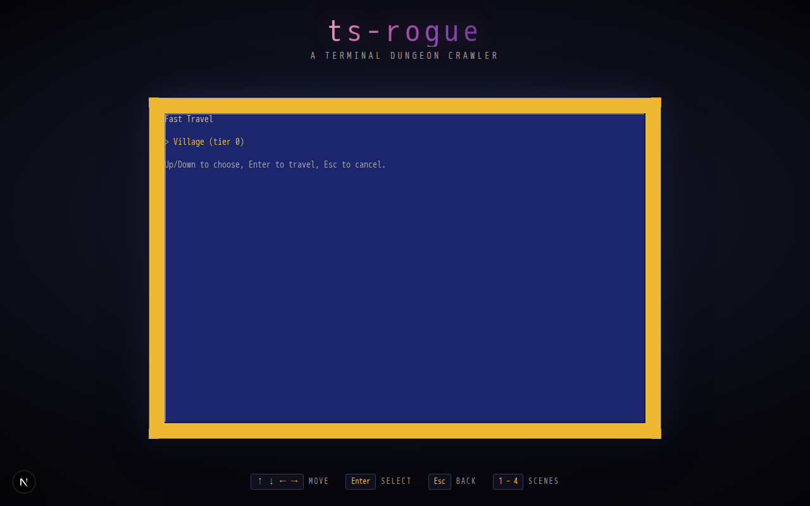

Fast travel (ENG-1): evac and zoom. Evac (`<` in any dungeon, outside battle)
opens a confirm prompt and, once confirmed, exits to the overworld standing on
the dungeon's entrance tile with the floor's explored/chest/cleared state
untouched. Zoom (`z` from the overworld or village) opens a picker listing
every landmark - the village and each dungeon entrance - the party has visited
this run, and teleports there on selection.

Neither evac nor zoom triggers an encounter or advances the overworld danger
accumulator. This also changes evac's existing behavior deliberately: it used
to reset the overworld encounter meter as a "welcome back" grace on exit;
that reset is removed so evac (and zoom) never grants a free danger-
accumulator reset.

Visited landmarks are tracked as `activatedWaypoints` on `GameState` (ids from
a new `world/waypoints.ts` registry), persist through save/load, and reset to
just the village on a new run.

