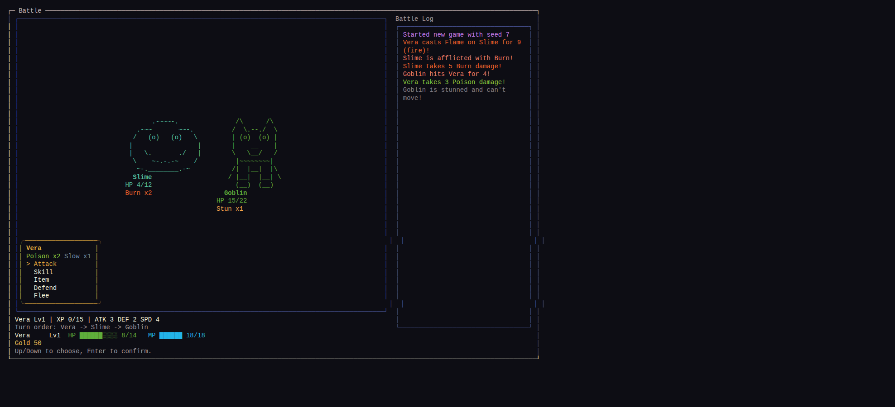

BattleScreen status UI (ENG-13): afflicted actors - the acting party member
and each enemy - show a badge per active status effect (poison, burn, stun,
slow, wet, oiled, chilled, frozen, shocked) with turns remaining, colored by
effect. Stun and frozen read the same way as any other status: a badge plus
the existing "can't move" log line when their turn is skipped.

A damage log line is now colored by the hit's element (physical, fire, ice,
lightning, poison) instead of one flat damage color, so a fire hit reads
differently from an ice, lightning, or poison hit, and status ticks (poison,
burn) inherit their element's color too.

