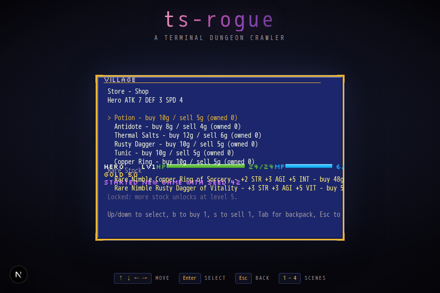

The village Store now scales with the party (ENG-41). The static catalog is
tiered by `ShopItem.minLevel`, unlocking mid/late-game consumables and gear
as the party's highest level rises (with a one-line teaser for the next
locked tier); buying a gear row mints a real common `ItemInstance` into the
backpack instead of an inert placeholder. A new Rare Stock section rolls 2-3
ilvl-appropriate magic/rare gear items through the existing loot resolution,
persists in the save so it never rerolls on load, and restocks on the same
cadence as the tavern recruit pool (inn rest). Buying a rolled item hands
over the exact instance shown, affixes intact, and its price stays pinned to
the single `itemSellPrice` source of truth used when selling it back. A
shared `ComparePanel` (now used by both the Inventory screen and the Store)
previews a rolled item against the current party member's equipped gear.



Terminal (Ink) equivalent:

```
Rare Stock
> Rare Nimble Copper Ring of Sorcery - +2 STR +3 AGI +5 INT - buy 48g
  Rare Nimble Rusty Dagger of Vitality - +3 STR +3 AGI +5 VIT - buy 50g
Locked: more stock unlocks at level 5.
```
