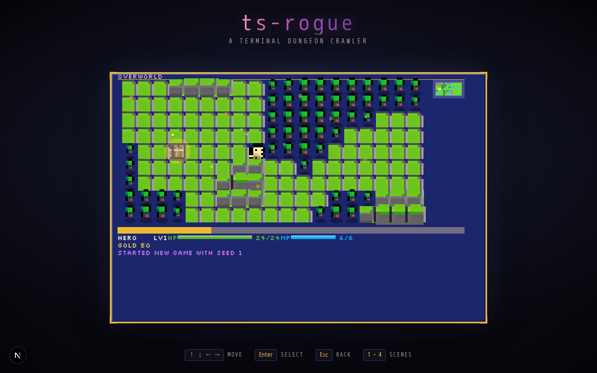

Overworld scene atmosphere (ROG-65, art direction §4/§6): the overworld's
Minifantasy tiles now sit under a decorative treatment layer instead of
drawing flat. Every mountain/forest/village/dungeonEntrance prop and the
party marker cast a soft ground shadow; village and dungeon-entrance markers
breathe with a slow glow-halo pulse; a sparse, deterministic subset of
visible water tiles glints with a shimmer; and a small pool of drifting
leaf/firefly particles reads the biomes currently on screen (leaves in
forest, fireflies over grass/forest). All of it animates via the same
per-frame `tick` hook `battleView.ts` already uses, and fully stops - not
just slows - when the OS requests `prefers-reduced-motion`. The camera/
viewport math, tile glyphs, and terminal renderer (`pnpm game`) are
unchanged.

