# ROG-31 screenshot tour

Real `tmux capture-pane` frames from a seed-1 playthrough on this branch,
converted to SVG. Reproducible from the seed plus the recorded key log
(`scripts/play.sh`).

### Title
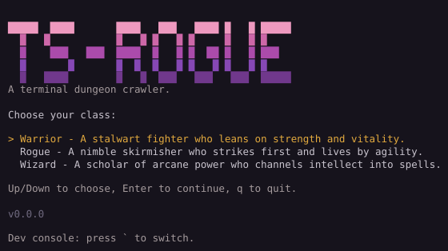

### Village
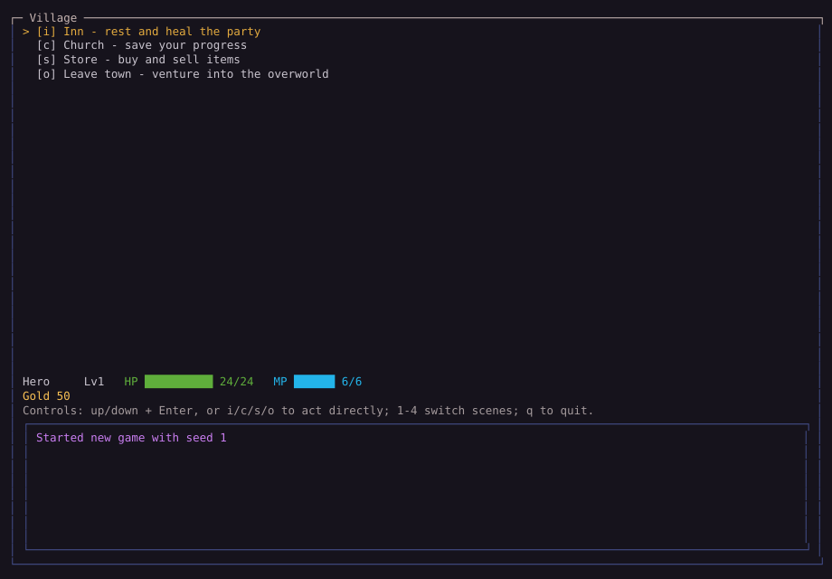

### Store — shop
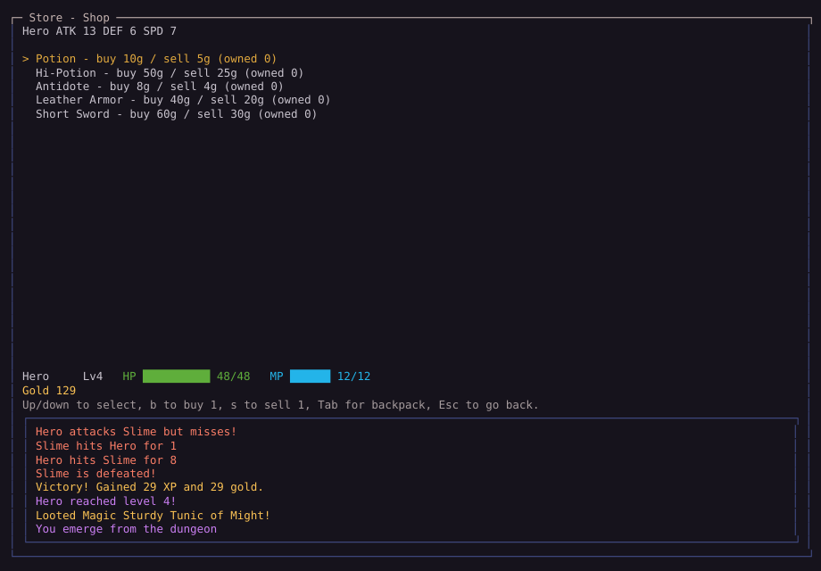

### Store — backpack (rarity colors)
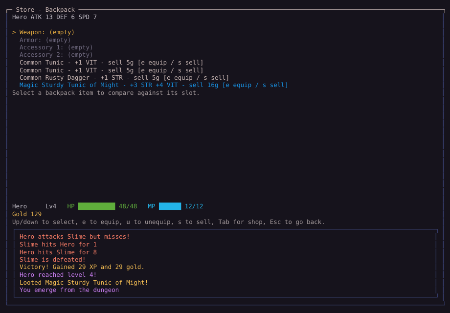

### Overworld biomes
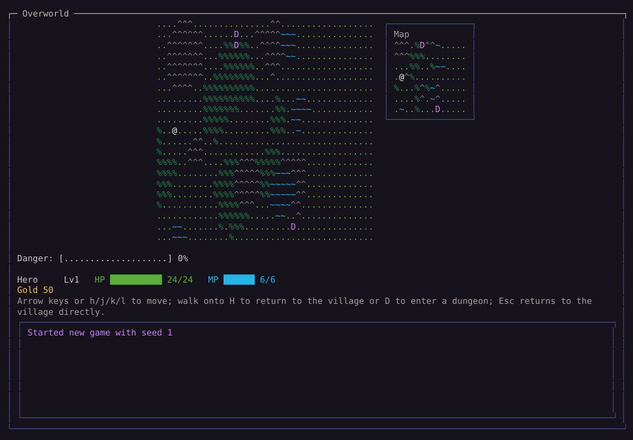

### Dungeon floor 1 (depth-shaded)
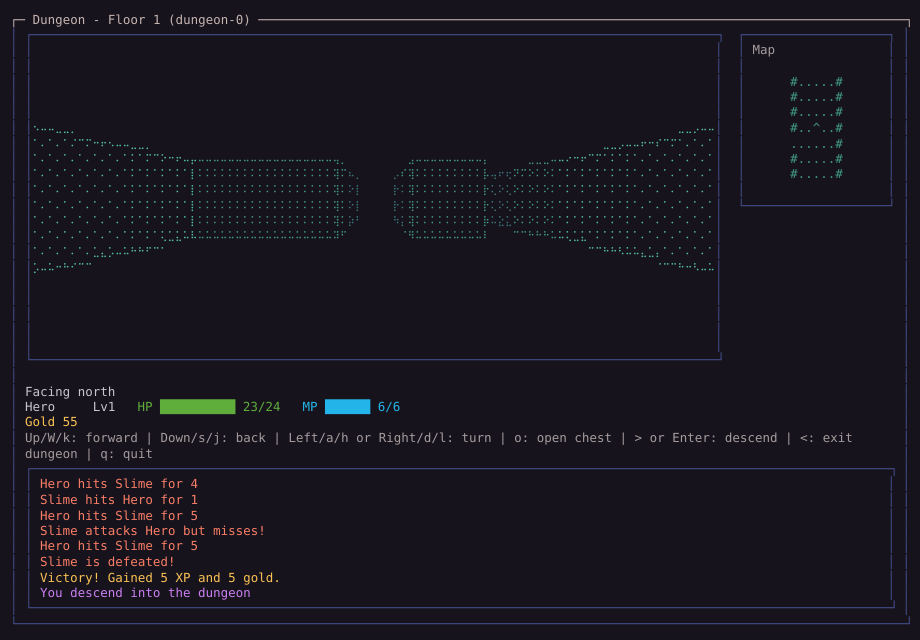

### Dungeon floor 2
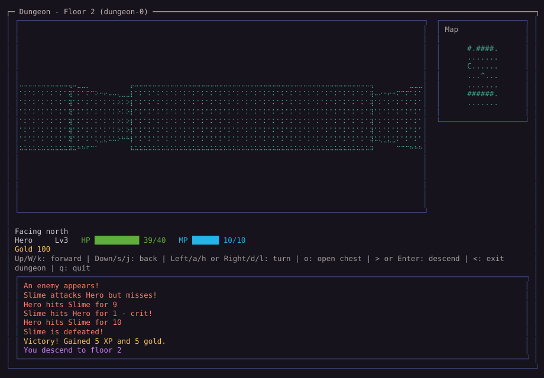

### Battle — slime ambush
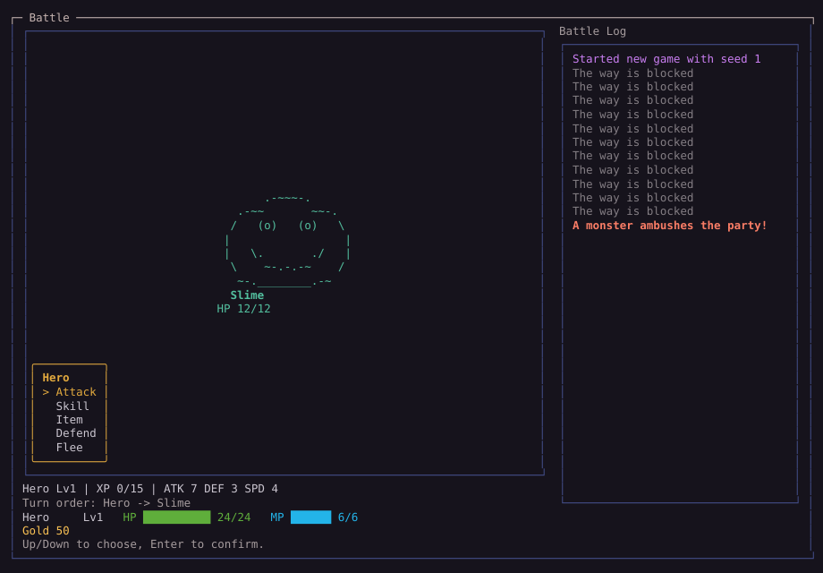

### Battle — goblin pack
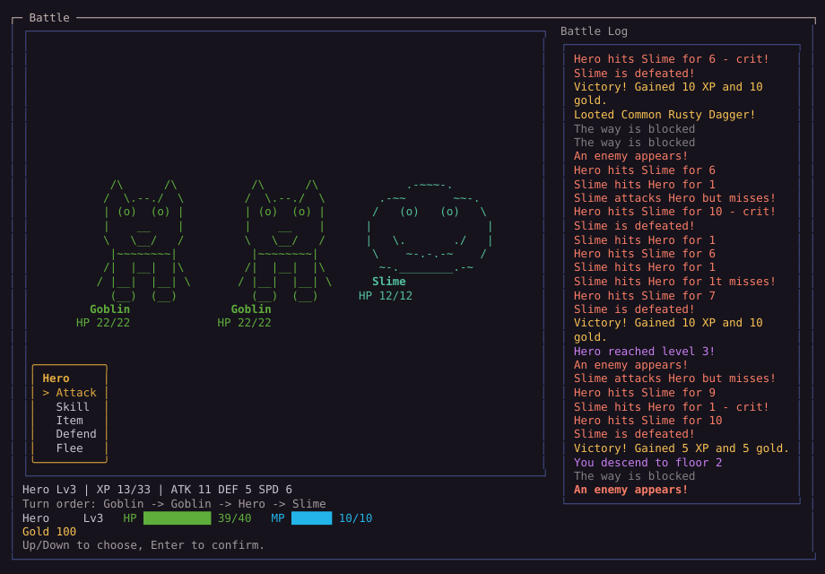

### Per-dungeon tints (all three ramps)
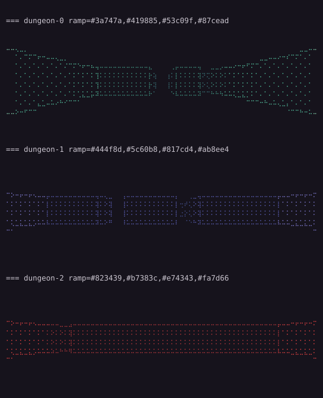

### 16-color degrade (TERM=xterm)
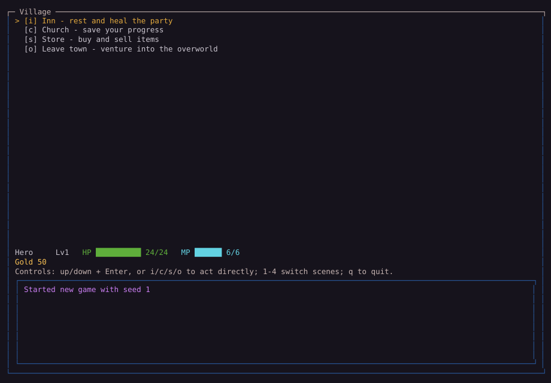
